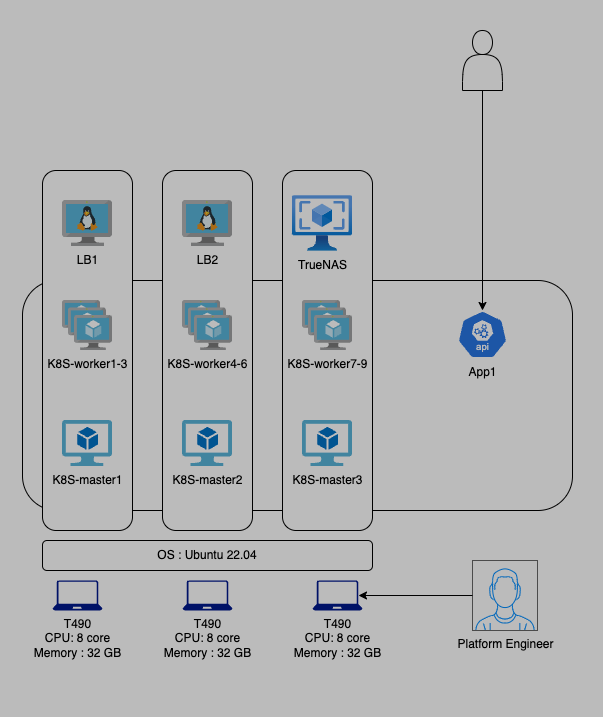

# Explore KVM bases virtualization

### Tutorial:

1. KVM Installation Steps on Ubuntu 24.04 LTS

## 1. Hardware used

| Type  | Devices | Specification |
| ------------- | ------------- | ------------- |
| Server  | 3 x Lenovo T470 Laptop  | 8 core, 32 GB Memory |
| Network  | 1 x HP Switch  | 4 port gigabit switch |

## 2. Architecture diagram

